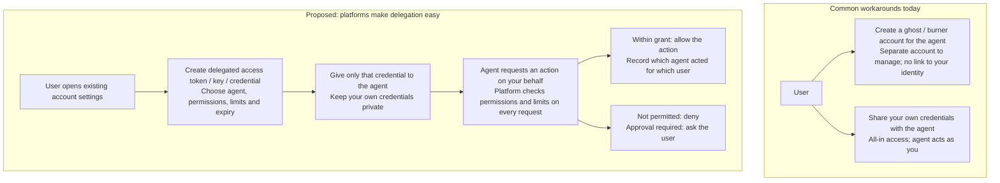

# delegated-agent-identity

A proposal for **Delegated Agent Identities (DAIs)**. The idea is that
services such as email providers, social networks, banks and card issuers let
a user create a scoped, revocable, clearly attributed sub-identity of their
own account for an AI agent. The **service** then enforces the limits, not
the agent's prompt.

> Think of it as a *GitHub fine-grained personal access token for your whole
> digital life, with spending limits*.

## Why

Today, to let an agent act for you, you either share your own credentials
(the agent gets all of your power), create a separate "burner" account (a
workaround that often breaks terms of service, and isn't possible for bank
accounts), or restrict the agent with system prompts and skills. Those
prompt-based restrictions are advisory and live on the client side, so
prompt injection or mistakes can get around them. Some source-side
mechanisms already exist — scoped OAuth grants, Open Banking consents,
platform roles, and capped virtual cards — but none of them give you a
**consistent agent identity, clear attribution of agent actions, and rich
per-grant constraints** across email, social, banking and payments.

## At a glance

**The shift:** no ghost account, no all-access credential sharing. Platforms
should let you delegate only what an agent needs, enforce those limits, and
let you revoke that agent's access without disrupting your own account.

## What

- A user creates a DAI in their account settings, for example
  `alice/agents/travel-assistant`.
- They grant **access levels** such as `mail.read`, `mail.reply`,
  `social.draft`, `bank.payment.known` or `card.pay.category`.
- They add **constraints**: credit/spend limits, rate limits, recipient or
  merchant allow-lists, time windows, and approval thresholds.
- The service **enforces** every request, **labels** agent actions, keeps an
  **audit trail**, and supports **instant revocation**.

## Documents

| # | Document | Contents |
| --- | --- | --- |
| 1 | [Situation and Problem](docs/01-problem.md) | How agents get access today and why it is unsafe |
| 2 | [Proposal](docs/02-proposal.md) | Concepts, access levels for email, social, banking and cards, constraints, lifecycle, protocol mapping |
| 3 | [Prior Art](docs/03-prior-art.md) | What identity providers, platforms, payment networks and standards already offer, plus a gap analysis |
| 4 | [Caveats](docs/04-caveats.md) | Security, adoption, legal/financial and social risks, open questions, and what you can do today |

## Status

Draft proposal for discussion. No code yet.
